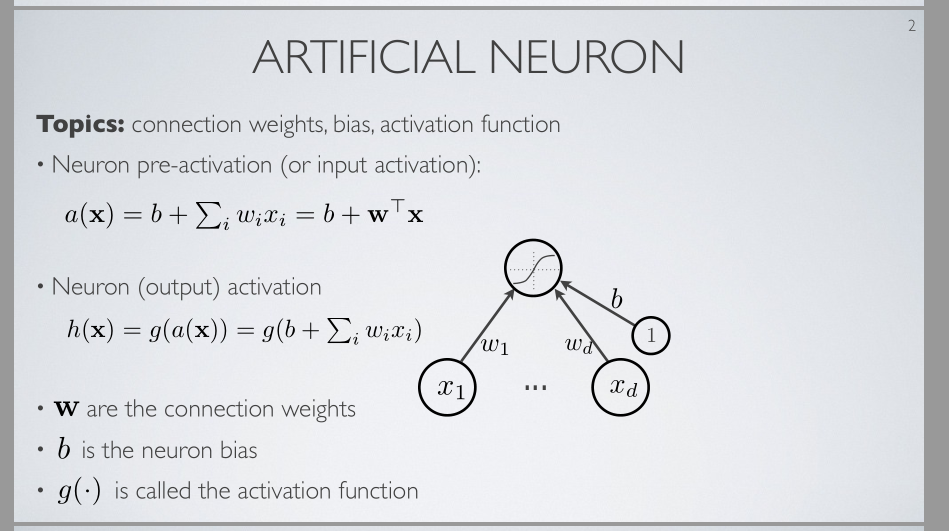
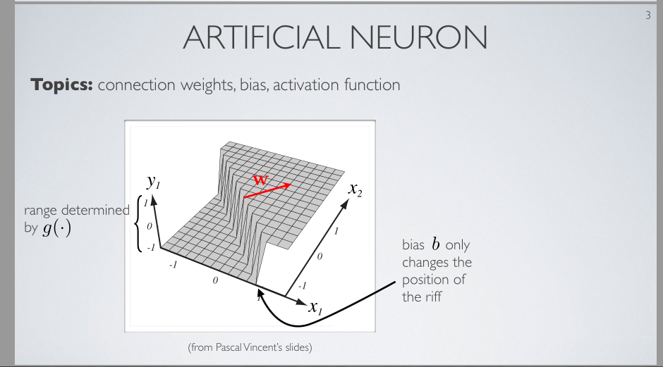

.. 注释 ():同位语  []:省略了 但其实是不可少的  {}:译者的话  "(x1,x2)":平面上的点坐标为(x1,x2)

人工神经元
==========================================================

.. toctree::

| 在这个视频，我们将介绍人工神经元的概念，人工神经元是基本建筑块，我们将用基本建筑块构建复杂神经网络

| 一个人工神经元是简单的一个计算单元,该计算单元连到其他单元 并 将做一个基于其他单元的特殊计算
| 上图是单人工神经元案例
| 我们想 从其抽取信息的某个对象的 一个输入描述 直连到此神经元， {以下 "此神经元" "神经元" 都是指上图中 中间有个曲线的 神经元}
| 这个输入描述，我们叫它x
| 这儿两个x本质上是一个向量, 该向量大小为d 并 包含标量x1到xd, 
| 注意，向量和矩阵我将用粗体来书写，而每当非粗体时表示一个标量值
| 所以xi是向量x的第i个元素
| 这个神经元将从x向量读信息 并 执行一个特殊计算，该特殊计算将决定神经元的值 
| 并且这个值将完全表示，在由向量x描述的对象中，关于 我们正在操纵的 主题的某个特定特征或信息 是否出现，
| 而将执行的计算能被拆成两步
| 第一步会是 此神经元的预激活计算
| 有时， 在你看讲义时 看到表达"输入激活"而不是"预激活" 
| 但是， 我将避免用输入激活 因为 对于x 我们经常也用词输入去描述
| 故我用预激活
| 对于一个给定的神经元，我记预激活为a(x)，
| 这a(x)是 指神经元偏置的某个标量b + 权重向量w乘输入向量x, 
| 可以把式子b+ sigma w*x写成向量形式
| 或写成多标量形式,即 b + 对于所有向量内下标i w的第i个元素乘以x的第i个元素
| 算出预激活a(x)后，再算神经元的激活，取预激活a(x)传递给激活函数所得值 作为神经元输出激活
| g函数就是激活函数，激活函数可能不同

| 据我所知输出激活是h(x) . 如果我省略"输出"那就只剩"激活"了 . 如果我只说"激活", 我的意思是一个给定神经元的"输出激活"
| {完成h(x)=g(a(x))=g(b+wx)的解释:} 综上， a(x)放在g中   显然是   激活函数g应用在 由元素xi组成的输入向量 的线性变换上，

| {解释权重w} 我们将w作为连接权重的向量 
| 这是因为 在这里的可视化{上图} 我们可以把w的元素当作 (输入)神经元们连接到输出神经元 的连接 强度 ,
| 这个案例中 图中这些xi神经元是指输入神经元,他们依次取输入向量中每一个元素的值 
| 所以w是连接权重的向量 
| {解释偏执b} b是偏执,因为如果我们没有输入x，b将是预激活
| 观察一个特定输入x 我们其实将远离神经元预激活初始值b .   然后像我说过的，外面的g是激活函数

 
| 这是一个神经元激活的二维可视化 {下网格面:网格面上y=-1处的曲面, 上网格面:网格面上y=+1处的曲面, ridge(翻译为岭):超平面:网格面上y=+1处的那条直线}
| 想象我们有一个由两个元素x1和x2组成的向量,
| 我们注意到y (这里不应写y而应写h(x)) 是作为神经元的输出激活
| y轴上，我们注意到的第一个事情 是 在这个轴这 我们获得 介于-1到+1之间的 值, 
| 这是因为， 在这个特定例子中， 一旦我们传递预激活给激活函数，  我们能获得的 激活值 的范围    是 一个在-1到+1之间的 数
| 现在我们看到， 对于向量x的不同值， 我们得到一个不同输出 
| 特别地   对于 躺在下网格面的 所有向量x，  我们得到一个神经元输出，一个非常接近-1的激活
| 而 对于上网格面的所有向量x， 我们得到激活值+1 
| 所以 在这个特定案例下 我们有一个人工神经元，此神经元检测 是否某个给定输入点"(x1,x2)"属于空间的这下网格面部分或空间的上网格面部分    所以你可以把这检测当作 :
| 这个人工神经元作为一个二分类器，  该二分类器 分离 在一个区域的点和其他区域的点
| 而现在 我们不打算讨论 我们如何找到神经元的参数w和b，这些参数决定了 该神经元分离了什么区域
| 现在 我们只是假定 有人已经给我们权重向量w的值和偏执向量b的值，w和b决定了这个函数g的形状
| 后面 我们会看到 我们怎么训练神经元以找到这些参数的好值
| 所以就现在 我们只是假定有人给了我们这些参数值

| {下面讲几何解释} 几何指出 向量w其实会垂直于在空间中的超平面，此超平面分割这两个区域，而此神经元也分割这两个区域
| 所以 这个向量w实质上决定了 在空间中 被此神经元分割的 这两部分之间的 岭 的 方向，
| 这个偏执b本质上决定了沿着这个岭的垂直方向, 此岭移动了多少 
| {岭的垂直方向即w的方向}
| 当偏执b增大, 岭会沿着w反方向移动
| 所以岭移动的大小和方向是-b决定的
| 如果你有更大的正b值 岭会以w反方向移动
| 我不会精确解释上面的几何叙述是为什么 但是你可以坐下来 试着指出 为什么w垂直于岭 为什么b增加会使岭沿着w反方向移动

| 以上就是此人工神经元执行的计算的描述

