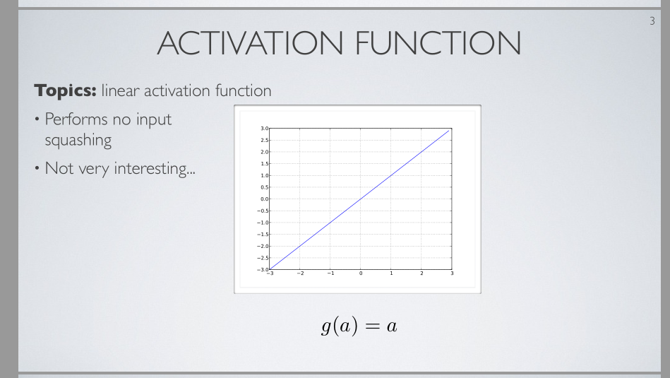

.. 注释     ~.xx.~  {}:针对xx 译者要说的话          ~.xx.~  {.}:针对xx 演讲者当时的动作         ~.xx.~  $.yy.# : 译者觉得要将xx换成yy才是对的, 可能是youtube自动翻译造成的错误、也可能是作者自己说错了、或别的啥

激活函数
==========================================================

.. toctree::
| 在这个视频中，我们将看到神经元激活函数的不同的可能选择

   
| 我们之前的:        神经元做的  计算    我们看到 包含了这个 被称为激活函数的 g函数
| 在这 我们将只看 在神经网络中 对于激活函数的 不同的流行选择

| 第一个选择是 简单地用一个线性激活函数
| 在这个案例中 激活函数g {.上图公式g(a)=a中的g}  取神经元的预激活值 并 简单地输出预激活值
| 如果我们画这个激活函数    你得到 这样的一条直线  {.上图的斜直线} 
| 故你没有执行任何 {对}输入的 挤压 {.squashing } 
| 激活函数 取输入 并 重新产生输入  {上一句和这一句 需要跟原视频核对一下}
| 故它没有上界或下界  
| 并且这激活函数是无趣的 部分因为这个原因 {无界?}
| 在神经元的计算中，该激活函数不产生任何非线性，而非线性或许 对于执行更复杂的计算 是有用的

   
| 一个更有趣的选择是 sigmoid 激活函数
| 它取这个形式 {.sigm(a)=1/(1+exp(-a))}
| 所以我们有时 用首字母缩写sigm 作为简写 {."sigm("}
| 它简单的取预激活值  {."(a)"}  ，然后它计算这个公式 {."1/(1+exp(-a))"} 
| 所以它是 1 除以   1 加 e的负激活值方 
| 如果我们画这个函数 {.函数图像} ，我们看到的是 该激活函数 将挤压{."squash"} 神经元预激活值 {到} 0和1之间 
| 我们看到所有的输出值是 在0到1之间 {"曲线 y [0,1]"}
| 预激活值越大 {."曲线 x往右"}  激活值越趋向于1
| 预激活值越小 趋向负无穷  {."曲线 x往左"}  而激活值越趋向于0 {."曲线 y 0"} 
| 所以这个神经元总是正的  {."positive"} 因为它总是严格大于0 {."图像 y 0往上"}
| 它是有界的 {."Bounded"} 神经元的激活值不能小于0 也不能大于1  {."曲线: y 0往下,  1往上  "} 
| 并且这个激活函数是严格递增
| {这是说} 预激活值越大 神经元的激活值将越高

   
| 另一个流行的选择是双正切或叫tange  
| 缩写成tanh  {."tanh"} 
| 它稍复杂
| 它也含有e {."exp(a)"}
| 一个形式 是这个形式   {."(exp(a)-exp(-a))/(..+..)"}       
|     e的{预}激活值  减去  e的负{预}激活值     除以    e的预激活值 加上 e的负激活值  
| 也能写成这种形式 {."(exp(2a)-1)/(..+1)"}，这个形式更方便 因为它只计算了一个e的指数{分子或分母上只有一个e}   
| 故 用这个 {."(exp(2a)-1)/(..+1)"}  {这句话 听不出来 youtube的自动翻译也是不对的}   它可能计算更有效 
| {这行移到上一行末尾去了}
| 在这个公式的分子和分母上 {. 分子 分母"(exp(a)-exp(-a))/(..+..)"}   乘以 e的激活值方 就能得到它 {."(exp(2a)-1)/(..+1)"} 
| 我们画这个函数  我们看到 {."图像 y [1,-1] "}    现在我们得到  被约束在-1到+1之间的 一个输出
| 所以 这个神经元说 它挤压 {."squash"} 神经元的预激活值    {到} -1和+1之间 
|       这里{不是input，写错了} 应该是pre-activation    {."squashed ... input between" 中的input划掉 并改为pre-activation ； 视频中的课件有这样错误 其网站上的pdf课件已经更改了 无此错误}          
| {此行移动到 上上一行末尾了}
| 所以激活值可以是正的或负的 {."... positive ... negative"}
| 和sigmoid激活函数类似，此激活值是有界的 {."Bounded"}
| and it is also strictly increasing {."...increasing"}

   
| 对于激活函数，最后的流行选择 是 叫 整流线性激活函数
| 我们简写为reclin {."reclin(a)"}
| 它简单的取 0和预激活值 中的最大值 {."max(0,a)"}
| 如果我们画它 {"沿着图像两条折线"}            
| 如果输入是大于0 {."图像 x 【0,正无穷)" }        我们得到  像一个线性函数的 一条直线  {"沿着图像右边斜线"}  
| 否则为0 {."沿着图像左边平线"}    是一条水平线
| 如果预激活值是负的  {."图像负半边"}  总是输出0
| 所以它只有下界0
| 它总是非负的
| 它无上界 {."Not ... bounded"}  
| 因为 预激活值越大 输出越大  {."沿右边斜线向右上方"}
| 输出总是增长    如果预激活值趋向正无穷 输出能发散到正无穷  
| 在实践中 我们看到 该函数 倾向于 给出 有稀疏激活的 神经元们 {."Tends to give neurons ..."}        意思是  该函数 倾向于 获得 经常精确为0的 神经元们  {."左边平线 y 0"}       这不同于sigmoid或tanh
| sigmoid或tanh的预激活值是精确的一个特殊值{时，其激活值才是精确为0. 而reclin的预激活值为整个负半轴时，其激活值就精确为0}
| 在sigmoid中， 获得0激活值 需要预激活值为负无穷， 这实际上不会出现
|  {此行移动到 上一行末尾了}
| 对于tanh， 要等于0激活值   需要预激活值精确为0
| 在此函数中 预激活值的 这整个区间 {."左边平线 x (负无穷,0]"}   都精确输出0激活值
| 由于这个原因 在许多不同的输入处的神经元 我们经常获得0作为该神经元的激活值
| 并且 我会说 由于这个原因 这个神经元会有稀疏激活或稀疏活跃

| 这些是 对于神经元的激活函数的 四个 不同选择 流行选择 