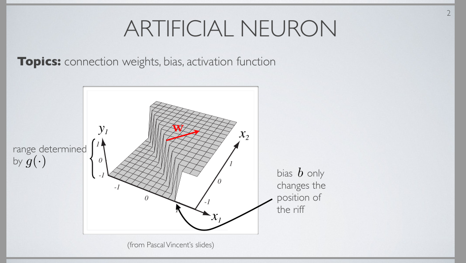
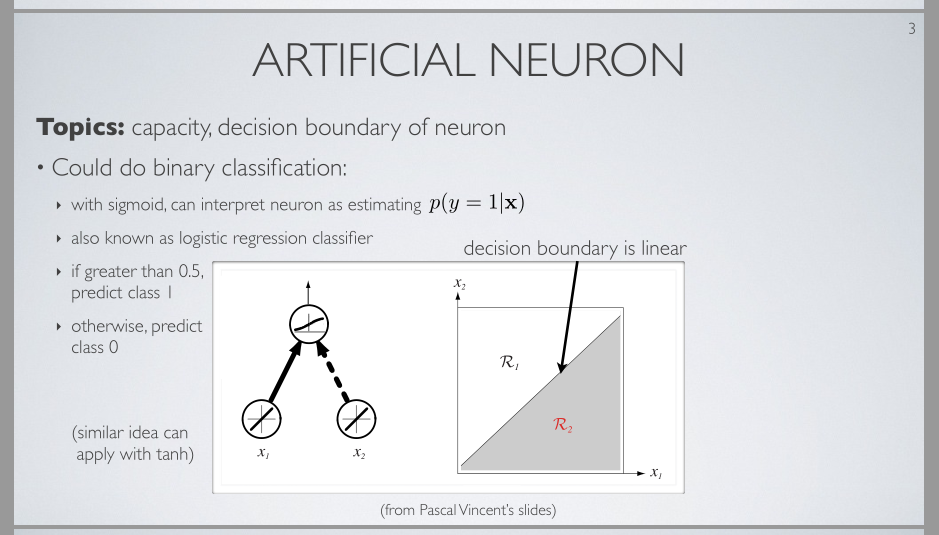
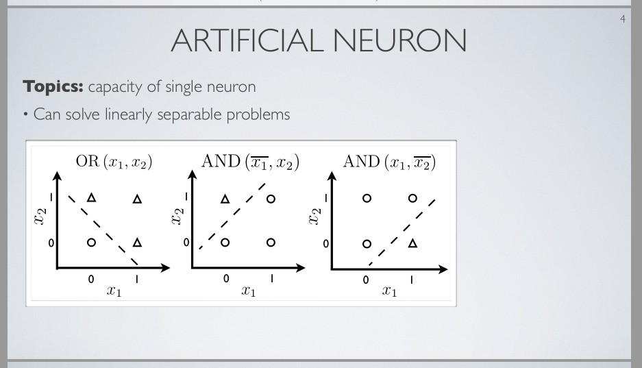
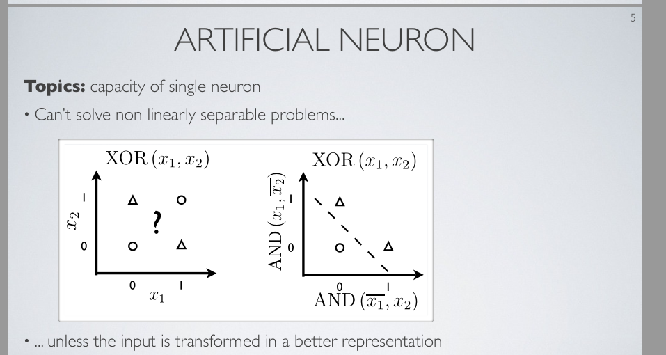

.. 注释     
.. {;xx} : xx是译者添加的 作为补充   
.. ~.xx.~  {}:针对xx 译者要说的话          
.. ~.xx.~  {.}:针对xx 演讲者当时的动作         ;  "xx"表示演讲者标出了讲义中的xx 
.. ~.xx.~  #.yy.# : 译者觉得要将xx换成yy才是对的
.. ~.xx.~  #..yy.# : 译者觉得 youtube自动翻译造成的错误          
.. ~.xx.~  ~..yy..~:  xx和yy意思是一样的。本来只需要xx出现，或yy出现，不需要同时出现。比如为了不同角度的表达

单神经元能力
==========================================================

.. toctree::

| 在这个视频中 我们会讨论单神经元的能力 {这能力}即神经元能执行的计算的复杂性
| 上次课， 我们已经看到 在二维空间， 
|         如果我们画一个给定神经元的输出或激活{. 图像 y1 h(x)} ，  会看到像这样的图像，
|         在这图像中 我们会获得 在空间两部分之间的 岭{画出岭} ，   在这图像中    岭   完全被岭的方向定义  被向量w定义    
|         且 {在这图像中} 偏执决定了岭的位置

| 带有 执行这种类型计算 的神经元
| 我们能执行二分类 {."binary classification"}   
| 如果我们用这个sigmoid激活函数   我们能解释 一个神经元的激活 为 估算   某个输入向量x {. "p(y = 1| x)"中的x} 属于类别1 的 概率{. "p(y = 1| x)"} .
| 让我们假定 在二分类中 y为0或1  {. 手写 " y 属于 集合{0,1}"}
| 然后我们考虑 一个神经元的输出或激活 {. "p(y = 1| x)"} 为 给我们                输入属于类别1{. "p(y = 1| x)"中的1 }  此神经元的估算是多少 .
| 属于类别2的 概率估值 是 1减去这个{. "p(y = 1| x)"}.
| 因为 概率必须和为1
| 所以 如果用sigmoid 我们能做这 {神经元的激活 解释为 属于类别1的概率}  因为sigmoid介于0和1之间
| {;它}总是向我们保证 在一个神经元的激活或输出    我们得到一个 能被解释为一个概率的 数
| 实际上    一个分类器的 这精确的形式         是以   logistic回归分类器 {. "logistic regression classifier"}   被知道的
| 它执行分类的 方式 是      如果神经元的输出      换句话说     如果神经元的 x属于类别1的概率 估值  大于0.5  {."if greater than 0.5"中的0.5}
|       则我们会 归类 输入 到 类别1 {."predict class 1"中的1} .
| 否则 我们的分类器将输出 输入属于类别0的 预测
| 如果我们 在二维中 画这{右函数图像}      如果我们看这{."decision boundary"}即决策边界  {在这个函数图像中}此决策边界本质上是 某输入对等的属于0或1 对等的属于任意类别 的表面
| 我们获得的实际上是    此分类器在执行一个线性分类        它{此分类器}画了 在两个区域间的 一条直线 {.右图像中灰白界线}     一个区域是和一个类别关联的  另一个区域是和另一类别关联的        它{此分类器}在画一个 实际为线性的 边界 
| 直观上 {决策边界}是一条直线        在多维时 {决策边界}会是一个超平面 
| 如果我们有一个   我们想 分  由输入向量描述的物体 到 两个不同类别 的    问题 .  如果我们能 画 一个超平面或一条直线 进 这两物体类别之间 .  那么 一个单人工神经元 能 为我们 做这{这个分类问题}. 它{此神经元}能 建模 这种决策过程.

| 这是 一些   能被一个线性分类器建模的 简单函数的  例子
| 如果我们有一个二维输入，该输入的 每维量为0或1  {.OR图像, x1 x2, 0 1}     故我们有 能为0或1的x1 {.OR图像, x1, 0 1}   能为0或1的x2{.OR图像, x2, 0 1} 
| 然后我们想 建模    取x1或x2的{."OR(x1,x2)"}  "或"函数{."OR(x1,x2)"中的OR}   
| 所以 对于 0 0    {.OR图像, x1,x2, 0 0}     该分类器会输出0{.OR图像, 左下角圈圈}  所以这是类别0          而 对于  1 0 , 1 1 or 0 1 {.OR图像, x1,x2,1 0,1 1,0 1} 该分类器会输出1 {.OR图像, 右侧三个三角形}.        所以 三角形们{.OR图像, 右侧三个三角形}相当于类别1
| 好了 我们能看到 如果我们画这{.OR图像, 虚斜直线}      我们很容易  在 所有圆圈和所有三角形 所有0和所有1 之间 打通一条直线
| 它是另一个 有点复杂的 函数{.AND(!x1,x2)}  取x1非、x2的与 .     然后 我们得到     所有这些家伙 {AND(!x1,..)图下三个小圈} 会是类别0           这个 {AND(!x1,..)图下那个小三角形} 会是类别1.   事实上 又一次  我们能 在两类别之间 打通一条直线{.AND(!x1,x2)图像, 虚斜直线} .
| 我们有另一个例子 {也是"与"函数} 但x2取非    ，  此函数  在这{AND(..,x2_)图下三角形} 我们得到一个类别1   在其他处 {AND(..,x2_)图下三个圈圈} 是类别0.     我们也能 {在两个类别之间} 打通 一条直线 {.AND(x1,x2_)图像, 虚斜直线} .
| 这些例子函数能很容易的 被 一个单人工神经元 建模

| 然而 在实践中 有许多问题 它们不是线性可分的
| 其实 他们是非常简单的函数   但不是线性可分的.    作为一个例子 另一个简单函数 异或函数{.左"XOR(x1,x2)"中的XOR}.    这是一个函数，  如果两个输入分量x1 x2都是0 {.左XOR,x1 x2,0 0} 或 都是1 {.左XOR,x1 x2,1 1}  则函数输出0 {.左XOR 两个圆圈}.  对于这两个家伙{.左XOR 两个三角形}, 当 输入分量 仅有一个 是1, 该函数输出1 {.左XOR 两个三角形} .
| 在这个案例中 对于这个点{左XOR 左上三角形}  这儿{x2轴 1}我们有1  这儿{x1轴 0}我们有0.  对于这个点{左XOR 右下三角形}  这儿这个 x1是1  x2是0  .
| 所以 在这个案例中 我们看到 我们不能只画一单个直线, 此直线实际上可以分离 在一边的所有这些0 和 在一边的所有1.  故此函数不是线性可分的.
| 但 它实际上是非常非常简单的问题.
| 所以 这{简单问题不能线性可分}表明  一个单人工神经元 对于许多 我们想要执行这种二分类的 问题 是 不足够的.
| {开始讲右边XOR} 然而 我们注意到    它是如此一个简单的函数      如果 我们 在这个坐标轴上{右XOR 横坐标轴} 画     像我们在前一个幻灯片看到 的那样   对 x1非、x2 应用"与"函数   的结果.            而 在这个轴上{右XOR 纵坐标轴} 我们用 对 x1、x2非 的 "与"函数 的输出   作为 此坐标轴值.
| 然后 这个点{左XOR 左下圈圈 } 和 这个点{左XOR 右上圈圈} 将被 坍塌到 一个单点{右XOR 左下圈圈}.   然后这个点{左XOR 左上三角形}  会对应到 那个点{右XOR 右下三角形}.  这个点{左XOR 右下三角形} 对应到 那个点{右XOR 右上三角形}.  
| 所以 在这个案例中 实际上 我们能      在 圆圈们{右XOR 左下圈圈} 和 三角形们{右XOR 右上两个三角形} 之间        在 关联到类别0的点们 和 关联到类别1的点们 之间      画一个单直线{右XOR 虚斜直线}
| 所以 这是在说 如果我们计算  我们输入向量的  一个修改的表示   一个更好的{'a "better" representation'}表示      则 此问题可以变成线性可分 .
| 这也建议 如果 我们有    完全 可 被 一个单神经元 表示的     这个{右XOR 纵AND}表示  另一个{右XOR 横AND}表示.   (这是 对于 这个 "与"函数{右XOR 横轴AND} 和  这个 "与"函数{右XOR 纵轴AND} 的案例.      之前 我们已经看到 我们确实能 用单神经元 建模 这两个函数. ) 
| 那么    靠    有其他神经元  被其他神经元连接.       {  上一句 和 这句话 合起来  是 "如果 那么" 的结构:  如果 AND 可以被单神经元表示 则 用一个神经元表示AND  再用另一个神经元 连到 神经元and  而另一个神经元将可以执行异或 }      
| 所以 我们 有 计算这个{右XOR 纵轴AND}的 一个神经元     计算那个{右XOR 横轴AND}的神经元. 
| 如果     我们连接这两个神经元{右XOR 横轴AND 纵轴AND} 到另一个神经元 {右XOR XOR}          直接地 连接{神经元}{.右XOR XOR} 到 那些神经元{右XOR 横轴AND 纵轴AND}           那么我们或许能计算         需要更复杂计算的  某种函数            更复杂的决策表面
| 这将是 在 开发 更复杂的 多层   神经网络  主要的直觉， 我们将在下一节视频中看到.