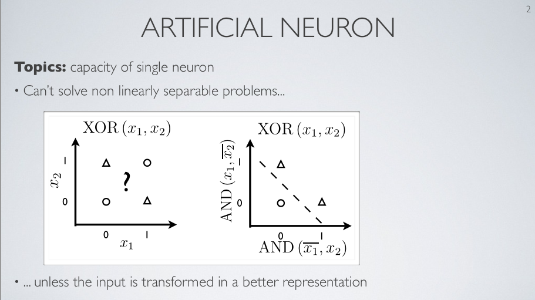
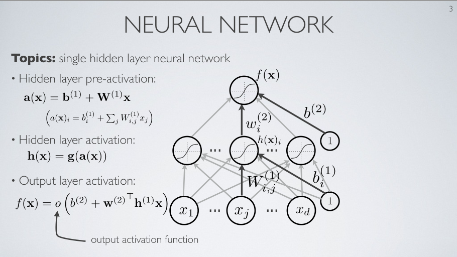

.. 注释     
.. {;xx} : xx是译者添加的 作为补充   
.. ~.xx.~  {}:针对xx 译者要说的话          
.. ~.xx.~  {.}:针对xx 演讲者当时的动作         ;  "xx"表示演讲者标出了讲义中的xx 
.. ~.xx.~  #.yy.# : 译者觉得要将xx换成yy才是对的
.. ~.xx.~  #..yy.# : 译者觉得 youtube自动翻译造成的错误          
.. #-.yy.# : 译者觉得 作者说错话了 试图用后面的词 来替代 yy    
.. ??yy??  : 译者没听出来 并用yy来占位
.. ~.xx.~  ~..yy..~:  xx和yy意思是一样的。本来只需要xx出现，或yy出现，不需要同时出现。比如为了不同角度的表达

多层神经网络
==========================================================

.. toctree::

| 在这个视频中 我们将正式介绍多层神经网络.
| 我们知道 之前 有特定问题 单人工神经元不能很好建模,
| 因为 它是一个 线性不可分的 分类 问题.
| 但是 我们已经明白  我们可以 取 输入表示 :	 试图 以某方式 靠应用某个简单转化 {.右图像 x y ; AND AND}  转化输入.
| {move up}
| 如同应用 这个例子中 这的"与"函数{.右图像 y ; AND}:	   
|   {该"与"函数}转化输入
|   {靠"与"函数}获得输入的 新表示     线性可分的 新表示    
| 如果这个表示{.右图像 x y ; AND AND } 的计算 能被 人工神经元 做
| 那么 对于更复杂的问题 {.左图像 }   建议用 一个更复杂的模型 {.左图像 } ,
|     该模型:    先计算    一些  计算新表示的 人工神经元 {.右图像 x y; AND AND}  
| 再连接这些神经元到一个输出神经元 {.右图像 XOR }  该输出神经元会做 剩下的工作, 
| 从而 完成 更复杂函数的计算.
| 这就是 多层神经网络的使用和开发 背后的 灵感

   
| 让我们 在单隐藏层的情况下 正式地看下这个想法 .
| so what mean 